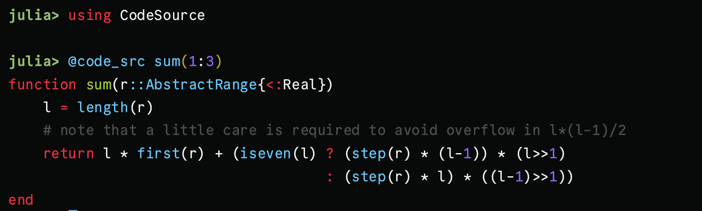

# CodeSource

[](https://github.com/ajinkya-k/CodeSource.jl/actions/workflows/CI.yml?query=branch%3Amain)

> [!NOTE]
> Attribution: The code is written by [Jerry Ling](https://github.com/Moelf) for a PR.
> I made a few changes and made this into its own package with permission from Jerry Ling.

This package provides two macros: `@code_src` and `@code_simple` that show the source code for a function call.
The `@code_simple` prints the function code without any syntax highlighting, while `@code_src` prints the function _with_ syntax coloring provided by `Crayon` and `OhMyREPL`.


```julia-repl
julia> @code_simple sum(1:3)
function sum(r::AbstractRange{<:Real})
    l = length(r)
    # note that a little care is required to avoid overflow in l*(l-1)/2
    return l * first(r) + (iseven(l) ? (step(r) * (l-1)) * (l>>1)
                                     : (step(r) * l) * ((l-1)>>1))
end
```


